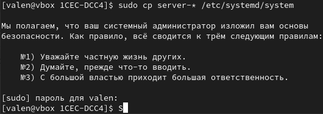
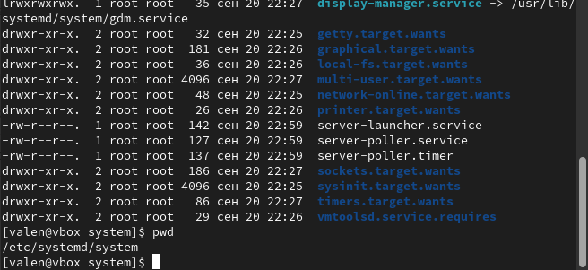
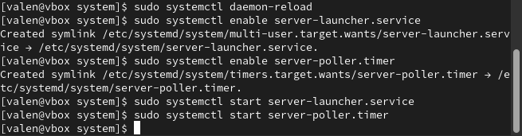
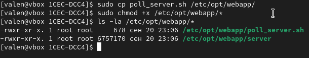
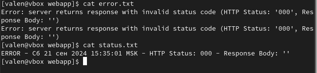
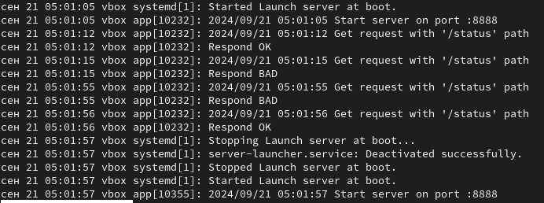
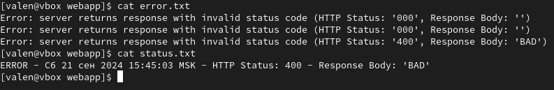
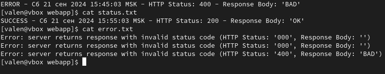

Для компиляции сервера используйте команду `env GOOS=linux GOARCH=amd64 go build -o app ./server.go` (предварительно небоходимо установить sdk `go`)

Т.к. общая директория у меня почему-то отказывается работать между основной ОС и гостевой ОС на виртуальной машине, то я решил просто подключить общую флешку.

Здесь я копирую код юнитов из флешки в нужную директорию `/etc/systemd/system`

Видим, что они файлы переместились

Включил юниты

Скопировал скрипт и сервер в /etc/opt/webapp, сделал скрипт исполняемым файлом

Изначально неправильно скомпилировал файл с сервером, поэтому юнит для запуска сервера нормально не запустился и в логах (файл `errors.txt`) статус код и тело ответа от сервера пустые.  
Последний ответ от сервера в файле `status.txt` также содержит пустой статус код и тело ответа.

Перекомпилировал сервер, перезапустил его и проверил, что он работает (сверху можно увидеть кусок логов, в которых написано, что сервер запустился на 8888 порту).
Логи получил командой `journalctl -u service-launcher.service -b`

Логи из папки `etc/opt/web/app/errors.txt` содержат причины сбоев сервера (видно, что сначала мы просто не смогли достучаться до сервера, потом он уже выдал 400 код).

Ниже можно увидеть содержание файла `etc/opt/web/app/status.txt`, в нем содержится последний ответ сервера

Чтобы увидеть все статусы сервера, в код самого сервера добавлен псевдо рандомный ответ (`OK` и `BAD`). Ниже можно увидеть `OK` ответ

