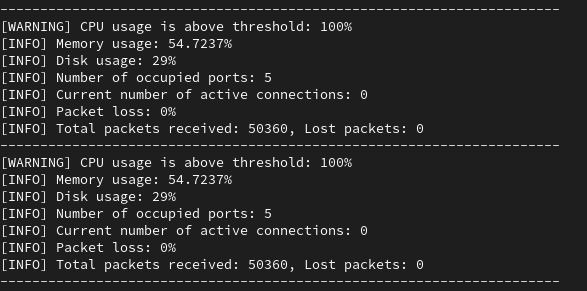

Скрипт выводит информацию о различных компонентах исстемы, при превышении заданных порогов выводится предупреждающее сообщение:

1. Загрузка CPU:  
2. Использование оперативной памяти:  
3. Место на диске:  
4. Количетсво занятых портов:  
5. Количество активных соединений:  
6. Мониторинг потерь пакетов:  
7. Отчет по сетевым пакетам:  

Скрипт работает в бесконечном цикле с интервалом опроса в 1 секунду, чтобы избежать спама логами о состоянии системы

Пример 

