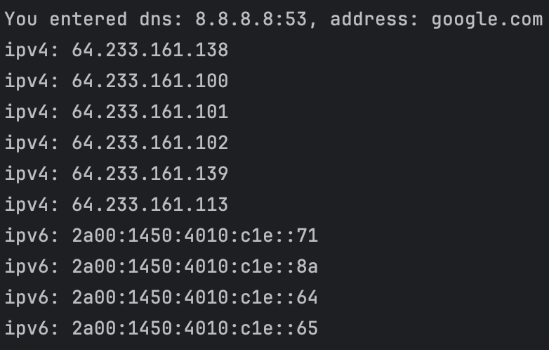

Пока реализовал только dns resolver.

Для реализации использовал rfc стандарт для DNS https://www.rfc-editor.org/rfc/rfc1035

Реализация на Golang, для компиляции тулы используйте команду `env GOOS=linux GOARCH=amd64 go build -o dns_resolver ./resolver.go` (предварительно небоходимо установить sdk `go`)

Вывод приложения по умолчанию для `google.com` (по умолчанию dns сервер: 8.8.8.8:53):

Команда для вывода адресов `google.com` с дефолтным dns сервером 
- `go run resolver.go google.com`

С указанным днс сервером
- `go run resolver.go --dns=1.1.1.1:53 google.com`
