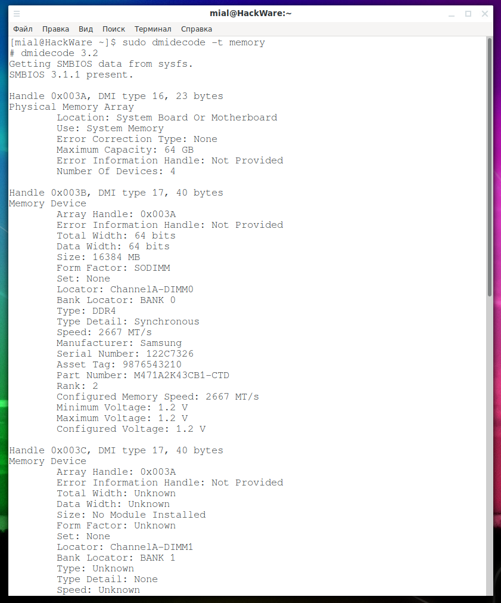

# 1 Задание

Первым делом делаем скрипт `cpu_info.sh`, для вывода информации о CPU памяти исполняемым файлом


Затем запустим его


Информации о памяти нету, связываю это с тем, что работа велась на виртуальной машине, если вызвать отдельно команду `dmidecode --type memory`, то никакой информации не увидим


Вывод должен быть похож на следующий 



# 2 Задание

Первым делом замаунтим раздел под hugepages с размером 2МБ


Затем скомпилируем программу


Посмотрим на использование huge pages


Если увеличить размер аллоцированной памяти до 8 МБ, то в выводе использования huge pages увидим 3 разервированных страниц


# 3 Задание

Запустим приложение балванку, которое будет потреблять ресурсы

```
#include <stdio.h>

int main() {
    while (1);
    return 0;
}
```

Посмотрим на процент использования ресурсов при помощи `htop`


Поменяем максимальный процент использования процессора до 75%


И повысим приоритет нашего приложения 


Запустим параллельно еще один экземпляр нашего приложения и выведем еще раз использование ресурсов при помощи `htop`


Видим, что первому приложению отдается ~75% процессорного времени, в то время как второе приложение использует оставшиеся ресурсы.


# 4 Задание

Создадим raid массив с `/dev/sdb1` и `/dev/sdc1`  


Добавим в него `/dev/sdd`


"Сломаем" `/dev/sdb1`


Видим, что диск поменял статус на `Failed`, однако это никак не отразилось на нашем RAID массиве


Перезапустим сломанный диск и увидим, что он обратно вернулся в строй


