Сначала я попытался сделать реализацию на Go, но здесь учитываются не все требования к лабораторной, т.к. я делал это еще до их анонса. Также на Go не получилось нормально выставить namespace'ы, поэтому в самом конце вы увидите еще реализацию на python, где этих проблем нету.

### Команды для билда исполняемых файлов:

**Приложение для запуска команды в cgroup**

`GOOS=linux GOARCH=amd64 go build -o ./bin/mydocker ./cmd/main.go`

**Приложение для нагрузки по памяти**

`GOOS=linux GOARCH=amd64 go build -o ./bin/memory_load ./memory_load/main.go`

**Приложение для нагрузки по CPU**

`GOOS=linux GOARCH=amd64 go build -o ./bin/cpu_load ./cpu_load/main.go`

Программа для запуска команды в cgroup имеет следующий интерфейс.
При помощи флагов `-memory` и `-cpu` можно задавать соответствующие ограничения. 
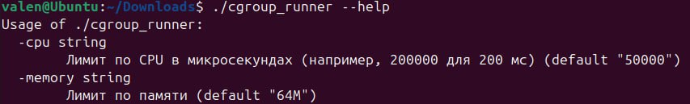

При вызове программы выводится дополнительная информация относительно введенной команды и созданной cgroup'ы

Сейчас мы запустили приложение, которое генерирует нагрузку на CPU

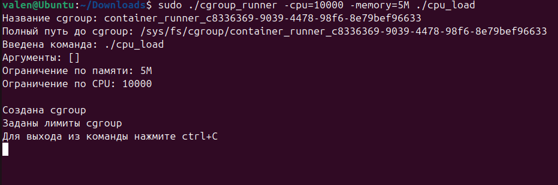

Если вызовем команду `top`, увидим следующую картину:
Наше приложение действительно занимает не больше 10% от процессорного времени, т.к. мы при вызове мы задали значение `-cpu=10000` 

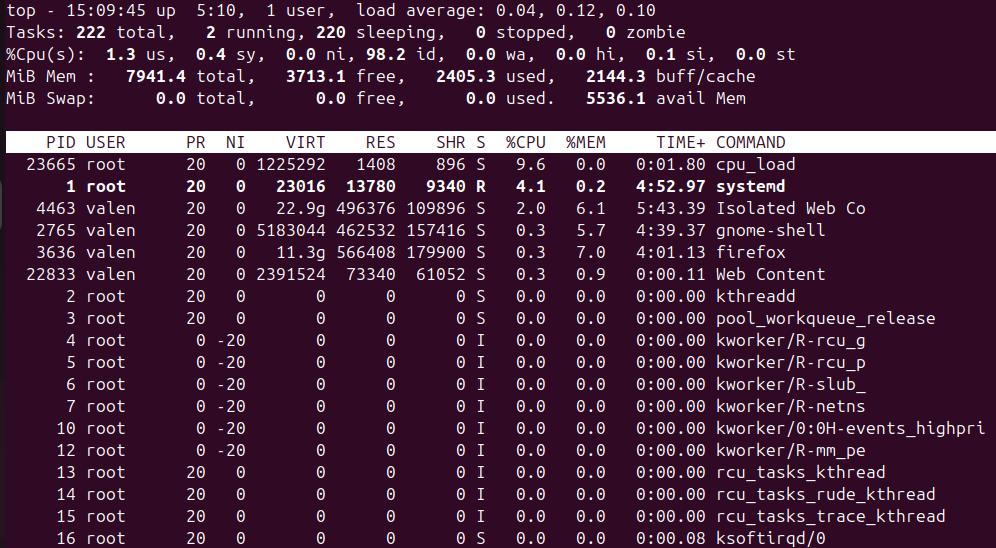

Перезапустим программу с другим ограничением по CPU (90000)

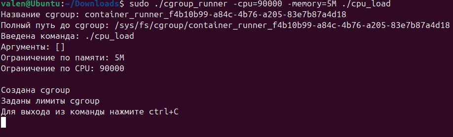

Также видим, что наше ограничение применилось

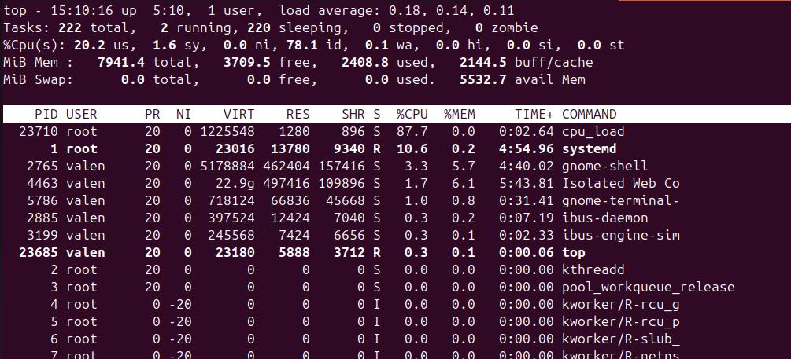

В самом алгоритме запуска команды в cgroup есть один неочевидный момент:  

Как выглядел алгоритм запуска изначально:
1) Создается директория для cgroup
2) Добавляются ограничения по памяти и CPU
3) Запускается команда
4) Берется pid команды и помещается в `cgroup.procs`

Я подумал, что в этом алгоритме есть недостаток, связанный с тем, что между вызовом команды и перемещением ее в cgroup есть промежуток во времени, когда наша команда никак не ограничена по ресурсам и не изолирована.  
Для того, чтобы избавиться от этой проблемы, перед запуском команды, pid родительского процесса (в котором и запускается команда) помещается в `cgroup.procs`, чтобы при вызове команды, она сразу находилась в этой же cgroup.

К чему это все - если мы запустим команду `ls -la` через приложение, то увидим вывод файловой системы родительского процесса.   

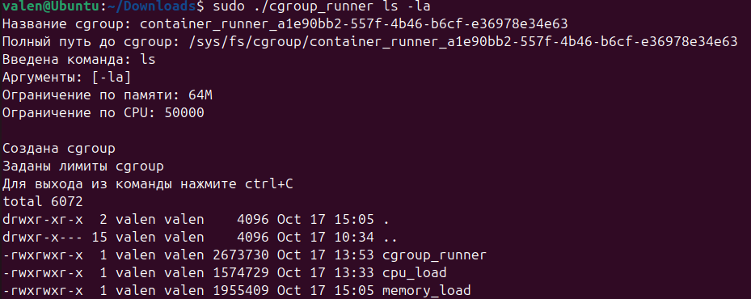

Если запустить приложение по нагрузке памяти, то почему-то память в cgroup'e у меня аллоцируется странным образом. На входе ограничение chroup'ы в 5Мб

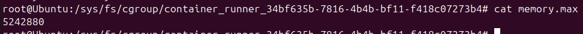

Само приложение аллоцирует 1МБ за раз, но в cgroup'e память почему-то аллоцируется неравномерно + не в том же объеме, которое действительно задействует приложение

Из-за этого происходит что-то следующее: выделяется память свыше ограничения cgroup'ы

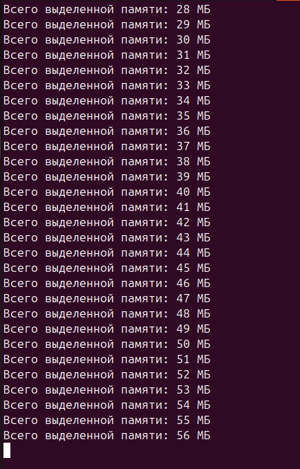

В самой cgroup'e показывается, что выделяется на порядок меньше памяти

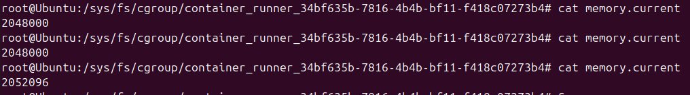

Если ограничить swap, то приложение все равно продолжает работать опять же из-за того, что в cgroup'e память задействуется не в том же объеме, что и в самом приложении 

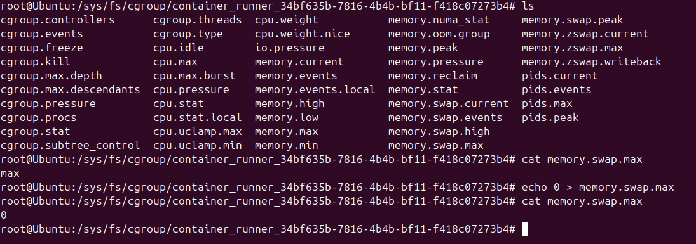

Если выделять по 100МБ, то OOMKiller конечно придет быстрее, но все равно не во время превышения заданного лимита

## Реализация на питоне

После анонса требований я понял, что не все сделал, также программа не выполняла некоторые пункты из требований, поэтому я решил попробовать переписать на Python (скрипт лежит в файле `my_docker2.py`).

Из основных изменений:
* Алгоритм запуска немного изменился, я сразу запускаю дочерний процесс через команду `unshare`
* Новый процесс запускается в новых PID и Mount namespace'ах

Если не указывать mount путь, то процесс запустится в той же директории, что и родительский. Также можно заметить, что его PID = 1 
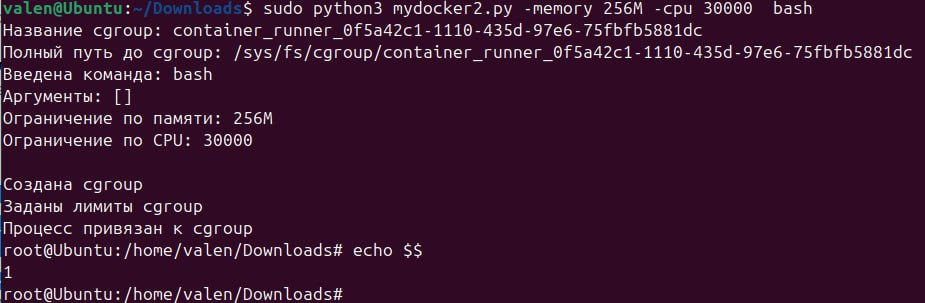

Если указать mount путь, то запустимся в указанной директории. 
Указанная директория была получена следующим образом:
1) Установил докер
2) Спулил образ almalinux
3) Выполнил команду `docker export $(docker create container_id) --output="rootfs.tar"`
4) Смаунтил архив через утилиту `archivemount` в `/mnt/rootfs`

Вот результат, видим, что запустились в другой директории
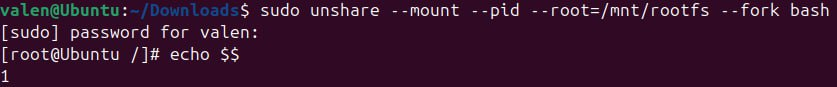

Возможность передачи аргументов не было в условиях, но я ее добавил. 
В данном примере аргумент `$$` высчитывается еще в родительском контейнере, поэтому видим PID != 1 

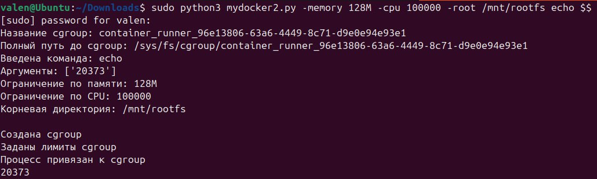

Ситуация с ограничением по памяти при использовании python скрипта не изменилась :(