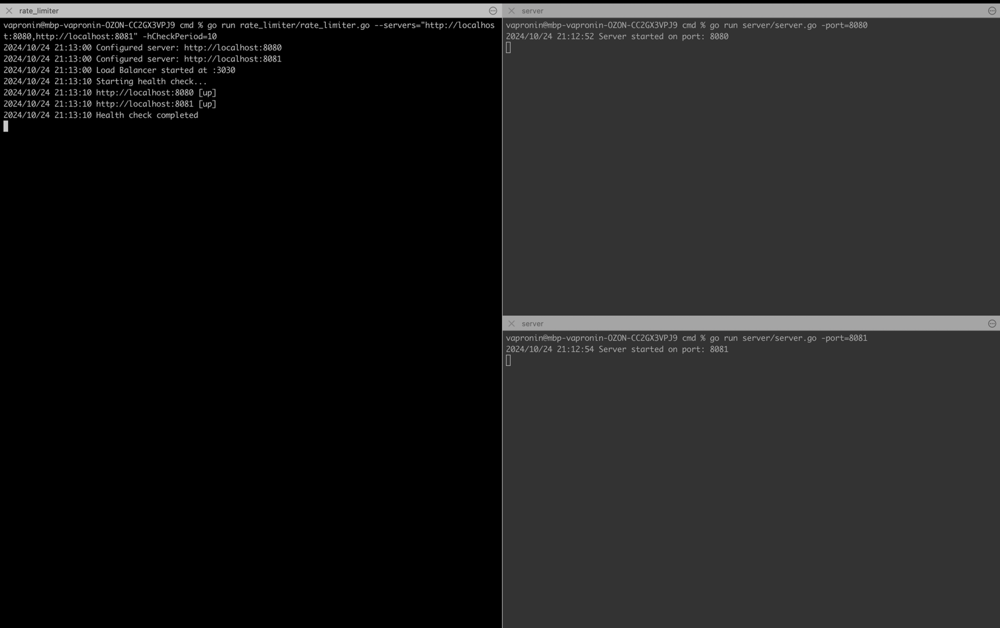
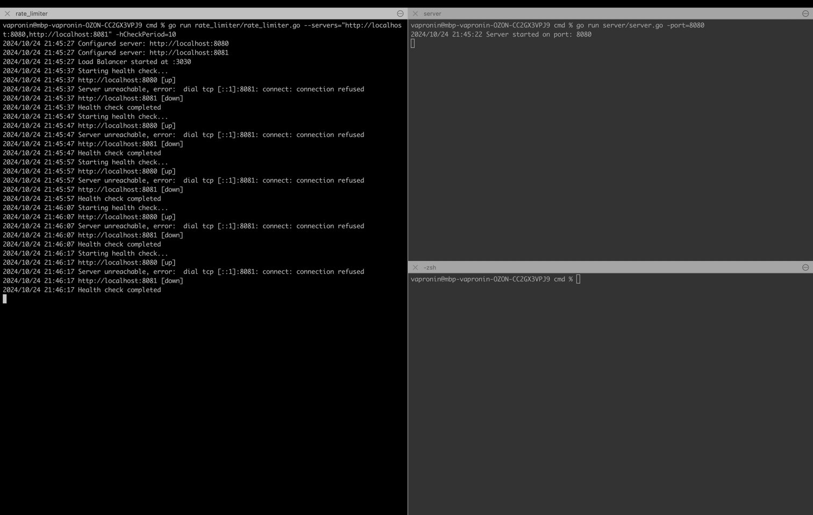
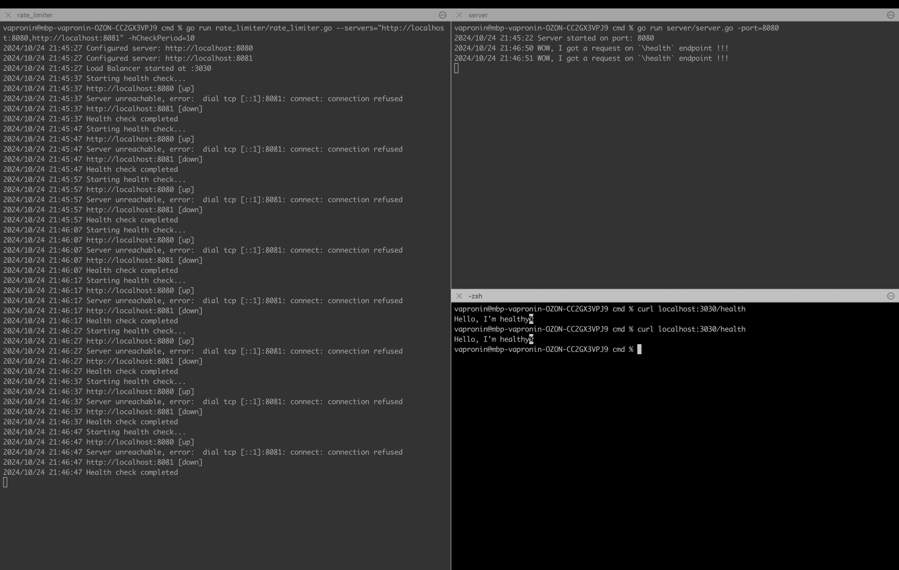
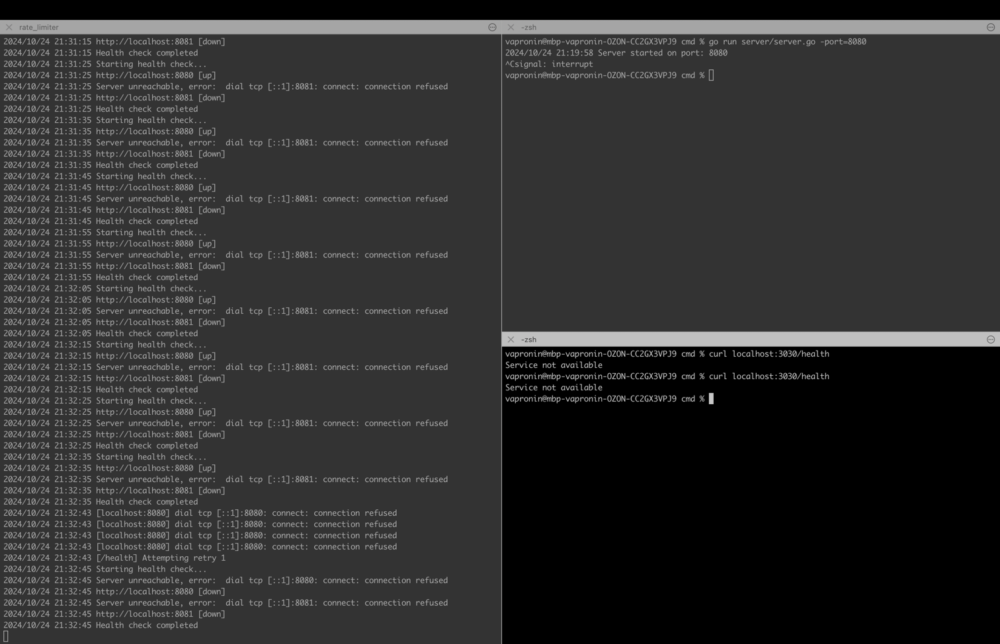
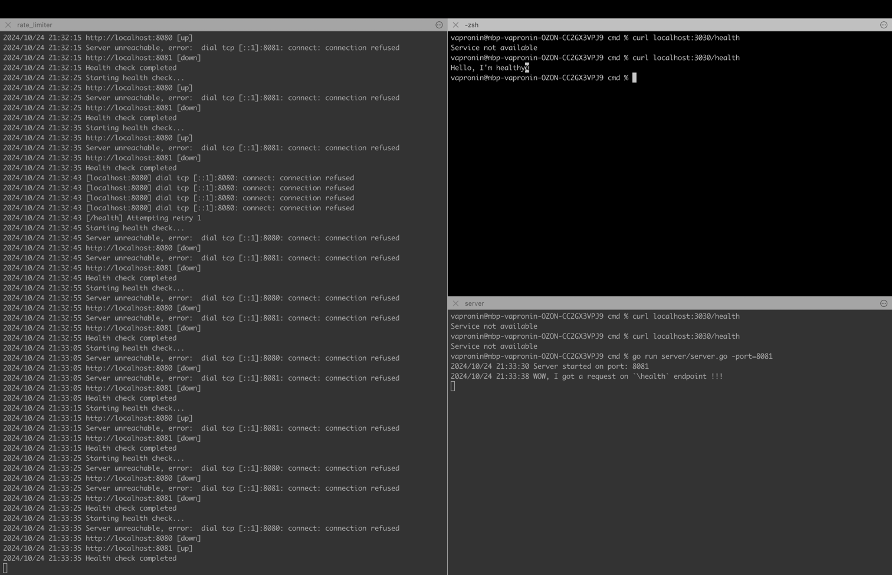
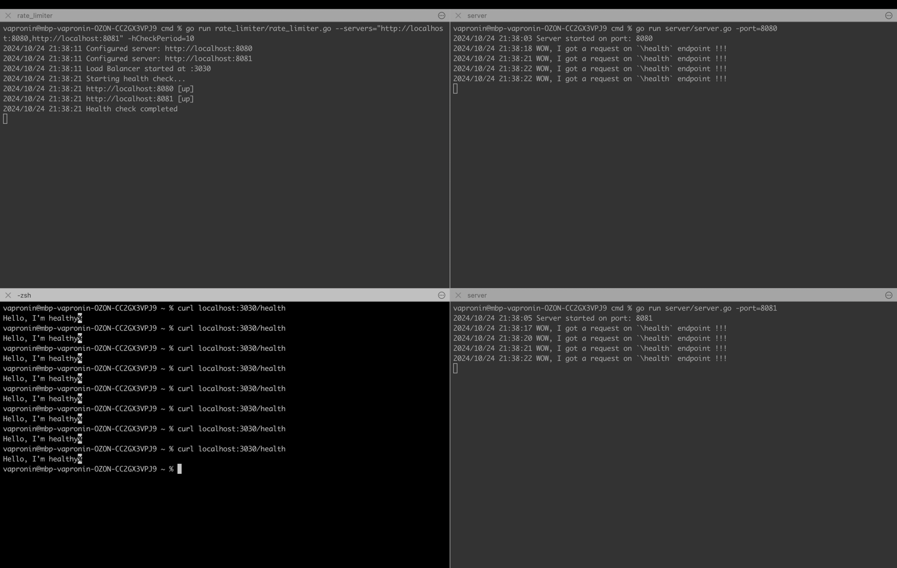
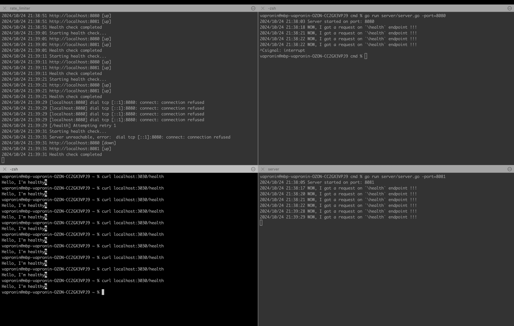

### * Слева - консоль балансировщика на порту 3030 (код в rate_limiter.go)
### * Справа сверху - консоль сервера на порту 8080 (код в server.go)
### * Справа снизу - консоль сервера на порту 8081 (код в server.go)

При запуске серверов и балансировщика можно увидеть в консоли балансировщика статус серверов 
```
http://localhost:8080 [up]
http://localhost:8081 [up]
```

Для балансировщика можно задать список адресов серверов для балансировки, период между health check'ами и порт для балансировщика.

Для серверов можно задать порт 



При остановке сервера на порту 8081 (справа снизу), увидим в консоли балансировщика (слева) инфомацию о том, что данный сервер недоступен (`down`)



Если попытаться отправить запрос на балансировщик (`curl localhost:3030/health`), увидим в консоли сервера на порту 8080 информацию о полученных запросах



Выключим все сервера и увидим, что балансировщик сообщает нам о недоступности всех серверов



Переподнимем сервер на порту 8081 и отправим на него запрос. Видим (в правом нижнем углу) информацию по полученному запросу



Поднимем все сервера и уже из новой консоли (слева снизу) отправим запрос на наш балансировщик. Видим, что запросы поочередно (используется алгоритм round-robbin) попадут на наши сервера.



Если попытаться отправим запрос на сервер, который до недавнего времени был запущен, но сейчас не работает, то запрос будет повторно отправлен (вплоть до 3 раз с периодом в 10 мс). В консоли балансировщика (слева сверху) видно, что в итоге было 4 запроса к серверу, которые закончились с ошибкой `connection refused` (т.к. сервер не успел подняться за время ретраев).

